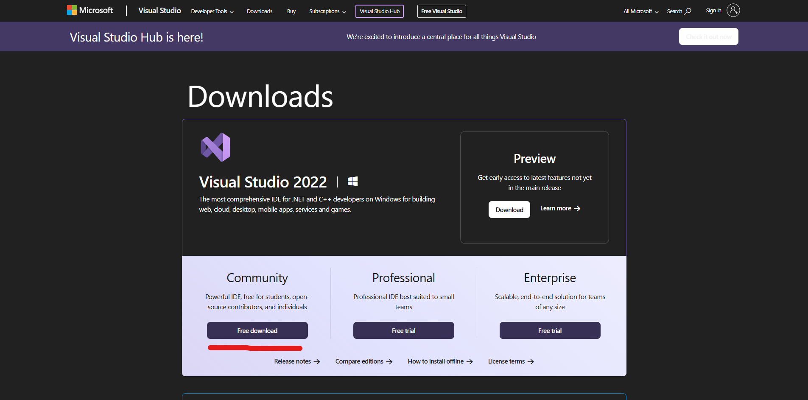
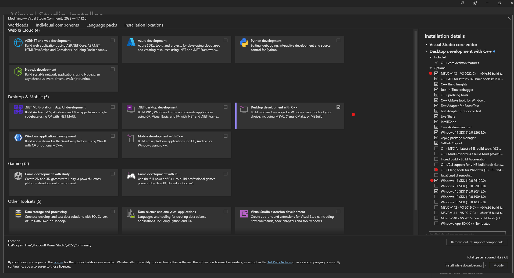

# Course Setup

In order to follow along with this course and future related courses there are a few things you'll need to have setup first:

1. A source code editor or IDE
2. A compiler that supports C
3. Optional - A Github account and Git

## Compiler Setup

### Windows

### Quick Setup - (Beginner Friendly)

If you're brand new to programming and setting up a developer environment you might want to start with a simpler IDE (Integrated Development Environment) setup.

[Code Blocks](https://www.codeblocks.org/downloads)

[CLion](https://www.jetbrains.com/clion)

Both choices above can help you get started coding, and running your applications with near zero setup after download and install.

Covers prerequisites 1 and 2.

### Setup VS and MSVC (Industry Standard)

On Windows Visual Studio and the MSVC toolchain is by far the most complete and highly used IDE and toolchain for C / C++ work. So we'll be covering how to set that up for yourself.

NOTE: Details and differences between compilers and C / C++ will be discussed at later points.

First we'll need to download the Visual Studio setup exe. It can be found at the following link:

[https://visualstudio.microsoft.com/downloads/](https://visualstudio.microsoft.com/downloads/)



After you have ran the program and you're on your selection page. You'll want to go to the Community Edition (this is free) and select the C++ development workload.

NOTE: Here you can also choose to include the install of C++ Clang tools (alternative C compiler).

Also ensure you have the following 2 components selected:

1. MSVC v143 - VS 2022 C++ x64/x86 built tools (latest)
2. Windows 11 SDK {latest} (or Windows 10 SDK if you're still on windows 10)



If you're fine using Visual Studio itself for development you can stop here.

#### Command Line Usage (CLI)

For those of you that have a preferred editor (emacs, vim, or simply want to avoid running the full Visual Studio IDE). Here we'll showcase how to setup and use the MSVC compiler (cl.exe) outside of Visual Studio.

VS by default installs a new developer command prompt (shortcut) that you can run yourself if you're fine using the command line.

```powershell
C:\ProgramData\Microsoft\Windows\Start Menu\Programs\Visual Studio 2022\Visual Studio Tools
```

Here's what the setup looks like for those of you that want to add it to windows terminal or cmder (default to x86).

```powershell
%comspec% /k "C:\Program Files\Microsoft Visual Studio\2022\Community\Common7\Tools\VsDevCmd.bat"
```

If you want the terminal to be set with x64 you can add the following argument to the end of the shortcut. If you plan to use Clang/LLVM I suggest you use this setup to avoid various issues.

```powershell
 %comspec% /k "C:\Program Files\Microsoft Visual Studio\2022\Community\Common7\Tools\VsDevCmd.bat" -arch=amd64
```

#### VS Code

Also since VS Code is an incredibly popular choice these days. We'll also cover how to setup the VS terminal there as well. If you open the command palette and search for your user setting json file. You can add the following code snippet to have the option of runnig the VS Developer termainl from within.

```json
  "terminal.integrated.profiles.windows": {
    "VisualStudio2022": {
        "path": [
          "${env:windir}\\Sysnative\\cmd.exe",
          "${env:windir}\\System32\\cmd.exe"
        ],
        "args": [
          "/k",
          "C:\\Program Files\\Microsoft Visual Studio\\2022\\Community\\Common7\\Tools\\VsDevCmd.bat",
          "-arch=amd64"
        ],
    },
  },
```

Now from within VS Code, you can run the cl.exe compiler for your C source code.


### Clang (CLI)

NOTE: Clang by default doesn't come with standard libraries you'll still need the MSVC libs (or others) installed.

If you'd prefer to use Clang/LLVM to have an easier and smoother time working through this course on multiple different operating systems.

The fastest and simpliest way to install clang (on windows) is by using winget. Simply paste the following command to install the LLVM toolchain and compiler.

```powershell
winget install --id=LLVM.LLVM -e
```

Once the install has completed you'll also need to add the following path to your system environment variables.

```powershell
C:\Program Files\LLVM\bin
```

## Verifiying Setup

Regardless of which setup you've choosen to use. Make sure you're able to copy the main.c file provided in this folder with the following code.  ensure you're able to create a file called main.c with the following code inside it:

```c
#include <stdio.h>

int main() {
    printf("Hello, World!\n");

    return 0;
}
```

And you're able to compile it the code succesful into an exe you can run.

Ex.

```powershell
REM MSVC Compiler
cl.exe main.c

REM LLVM C Compiler
clang main.c
```

### MacOSX

TODO

#### XCode

#### Clang / LLVM

### Linux

TODO

#### Clang/LLVM

#### GCC
